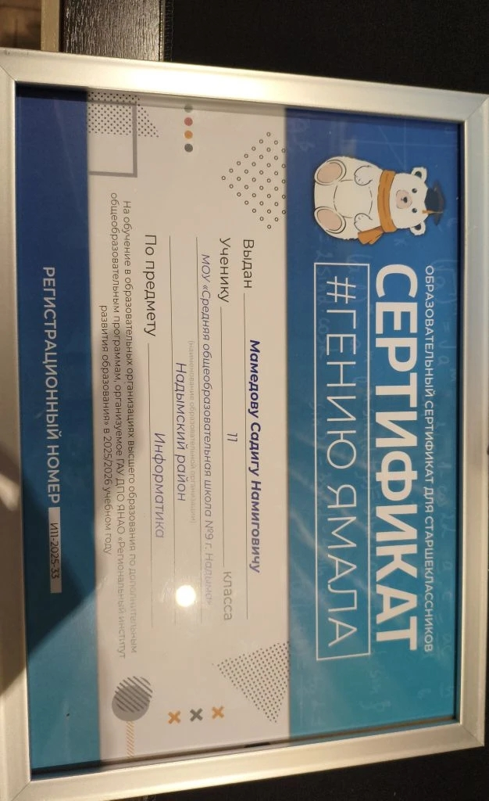
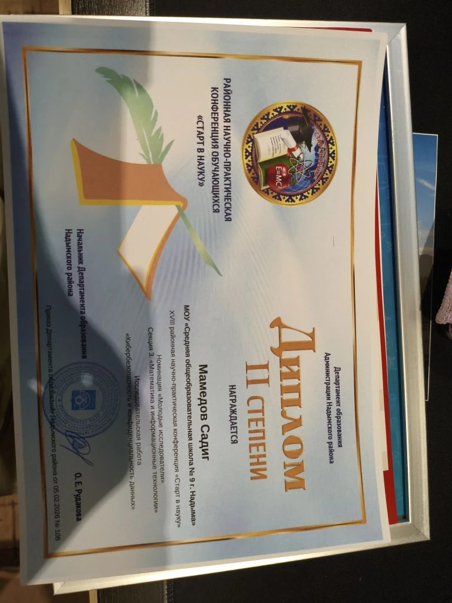
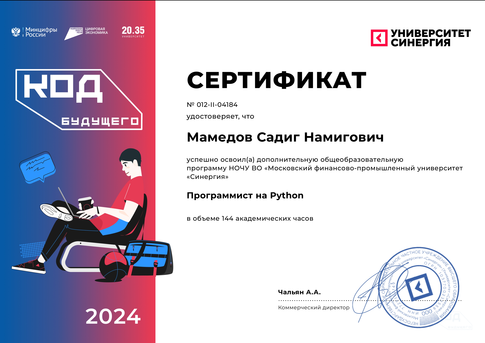

  

----

  

------

## Through life: A schoolboy and a future programmer

### 👨‍💻 A little bit about yourself:
At the age of 11, I developed a passion for a career in software testing. From the age of 13, I began learning programming, which is where I discovered and mastered development tools such as Visual Studio Code. This experience marked the beginning of my professional journey, shaping my goals and competencies in the field of information technology.

----

  

-----

## 🏆 My Achievements / Мои достижения:

  <table>
    <tr>
      <td align="center">
        
         <b>🏅 Сертификат «Гений Ямала»</b>
         МОУ СОШ №9, 2026
         "Genius of Yamal" Certificate — School No. 9, 2026
      </td>
      <td align="center">
        
         <b>🔬 Диплом «Старт в науку»</b>
         Научно-практическая конференция
         "Start in Science" Diploma — Scientific and Practical Conference
      </td>
      <td align="center">
        
         <b>💻 Сертификат «Код Будущего»</b>
         Python, 144 часа, Университет «Синергия»
         "Code of the Future" Certificate — Python, 144 hours, Synergy University
      </td>
    </tr>
  </table>

-----------------------

## 📊 My stats / Моя статистика:

<table align="center">
  <tr>
    <td align="center" width="50%">
      
    </td>
  </tr>
</table>

  

-------

## 🚀 My main projects / Мои главные проекты:

### 🛡️ My first antivirus / Мой первый антивирус

  

  <code>Python</code> · <code>os</code> · <code>shutil</code>

-----

## 🌍 Contacts and facts / Контакты и факты:

- 🌍 I'm based in Russia  
- ✉️ You can contact me at [saidermilijery143@bk.ru](mailto:saidermilijery143@bk.ru)  
- 🧠 I'm currently learning in-depth Python  
- 💬 Ask me about: *This is my first profile edit, so don't judge me too harshly*

------

### 🛠️ Skills / Навыки:

| Python | HTML | CSS | VS Code |
|---|---|---|---|
|  |  |  |  |
----------

### Socials / Социальные сети:

  
  

